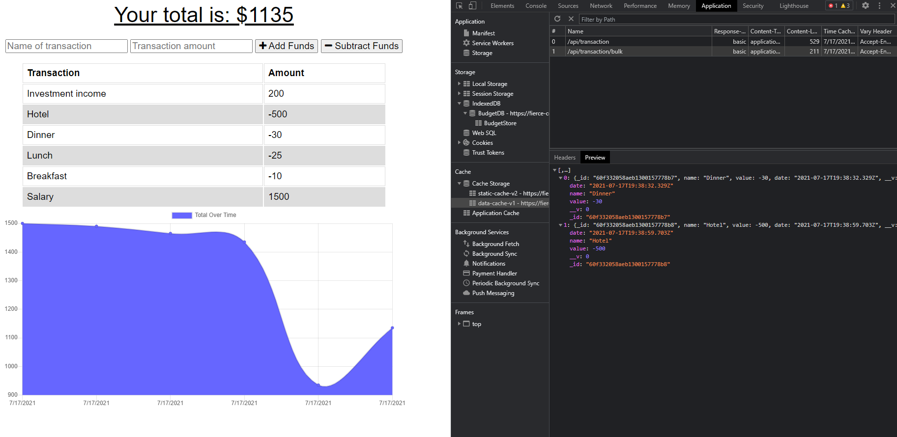

# Online/Offline Budget Tracker (Progressive Web Application)

## Table of Contents
[Description](#description)  
[Key Features](#key-features)  
[Technology Used](#technology-used)  
[Links](#links)  
[Screenshots](#screenshots)  
[License](#license)  

## Description
This homework assignment for the University of Toronto SCS Coding Boot Camp was to build a budget tracker with online and offline functionality. Starter code was provided excluding the offline functionality. The focus of this assignment was to create a web manifest and service worker script so that the user can be offline and still use the application with offline transactions being sent to the Mongo database once back online. In addition, the application is deployed on Heroku using MongoDB Atlas and can be downloaded as a Progressive Web Application (PWA).

## Key Features
- User is able to add their transactions either spending or income and then their overall balance is updated and displayed along with a graph.
- Static assets such as CSS style sheets, icon images, JavaScript and HTML files are captured in a cache for offline access
- IndexedDB, a data cache and service worker script are used to handle transactions when the user is offline and then goes back online

## Technology Used
- HTML, CSS, JavaScript
- MongoDB Atlas
- Heroku
- Robo 3T
- Progressive web application (i.e., manifest, service worker, Indexed Database API)
- NPM packages: express, mongoose, morgan, compression

## Links
- [GitHub repository](https://github.com/darylnauman/budget-tracker)
- [Deployed application on Heroku](https://fierce-cove-33344.herokuapp.com/)

## Screenshots

### Home page

### Home page with an example of an item in the BudgetStore (seen in development tools).

### Main page with display of the static cache (seen in development tools).

### Main page with display of the data cache (seen in development tools).

## License
This product is under the MIT License.
